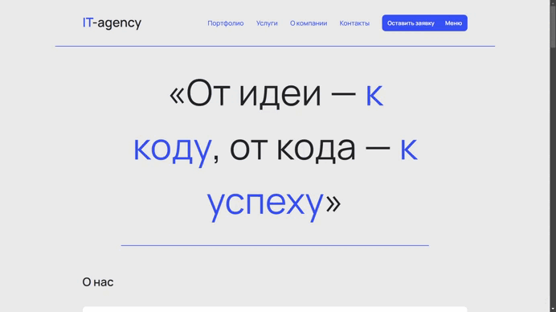

# IT Agency Website | Landing Page

  

## Описание
Вёрстка лендинга для IT-агентства. Учебный проект, включающий:
- Адаптивный дизайн (mobile-first или desktop-first)
- Современные CSS-эффекты (анимации, hover-состояния)
- Семантическую разметку HTML5
- Модальное окно, offcanvas, карусель

## Технологии
- HTML5, CSS3 (Flexbox)
- Bootstrap

## Автор
- GitHub: [@Anatoliy-Antonov](https://github.com/Anatoliy-Antonov)